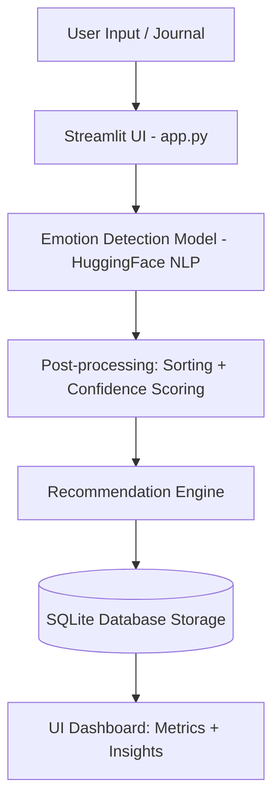

# 🧠 MoodMind AI

<div align="center">

**AI-powered mental health journaling app that detects emotions from text and provides personalized wellness insights in real-time.**

[](https://www.python.org/)
[](https://streamlit.io/)
[](https://huggingface.co/)
[](https://www.sqlite.org/)

[**🌐 Live Demo**](https://mental-health-mood-tracker-ai-ofkfmgzpl77w7g7jfg6toe.streamlit.app) • [**📁 GitHub Repository**](https://github.com/SHALINISAURAV/mental-health-mood-tracker-ai)

</div>

---

## 📖 About The Project

**MoodMind AI** is an end-to-end AI product designed to act as a smart mental health journal. By analyzing daily journal entries using advanced Natural Language Processing (NLP), it detects underlying emotions and provides users with real-time mood analysis, confidence scoring, and personalized wellness recommendations.

It bridges the gap between digital journaling and actionable mental wellness insights by combining AI inference, data storage, and an interactive dashboard.

### 💡 Key Highlights

* **End-to-end AI Product:** Fully functional application with UI, ML, and database integration.
* **Modular Architecture:** Clean separation between UI, ML models, database, and recommendation engine.
* **Real-time Inference:** Instant emotion detection using HuggingFace NLP models.
* **SaaS-Style UI:** Clean and interactive dashboard built with Streamlit.

---

## 🚀 Features

* 😊 **Real-Time Emotion Detection** – Detects emotions instantly from journal text.
* 📊 **Mood Analytics Dashboard** – Displays emotion breakdown with confidence scores.
* 🧠 **AI Wellness Recommendations** – Personalized mental health suggestions.
* ⚠️ **Distress Detection System** – Identifies emotional distress and suggests help resources.
* 📝 **Secure Journal Storage** – Stores entries and mood history using SQLite.

---

## 🏗️ System Architecture



---

## 🛠️ Tech Stack

* **Programming Language:** Python 3.x
* **Frontend/Framework:** Streamlit
* **Machine Learning:** HuggingFace Transformers (Emotion Classification)
* **Database:** SQLite
* **Deployment:** Streamlit Community Cloud

---

## 🔁 Workflow

1. **Input:** User writes a journal entry.
2. **Analysis:** NLP model predicts emotions from text.
3. **Processing:** Emotion scores are sorted and normalized.
4. **Insight Generation:** Recommendation engine suggests wellness actions.
5. **Storage:** Data is saved in SQLite database.
6. **Visualization:** Dashboard displays mood history and insights.

---

## 📁 Project Structure

```
mental-health-mood-tracker-ai/
│
├── app.py                      # Main Streamlit application
│
├── ui/                         # Frontend components
│   ├── sidebar.py
│   ├── components.py
│   ├── dashboard.py
│   └── custom_css.py
│
├── models/                     # ML inference layer
│   └── inference.py
│
├── database/                   # SQLite operations
│   ├── db.py
│   ├── schema.py
│   └── crud.py
│
├── suggestions/                # Recommendation system
│   ├── recommendation_engine.py
│   └── emergency_support.py
│
└── assets/                     # Static files
```

---

## 💻 Installation & Local Setup

### 1. Clone Repository

```bash
git clone https://github.com/SHALINISAURAV/mental-health-mood-tracker-ai.git
cd mental-health-mood-tracker-ai
```

### 2. Create Virtual Environment

```bash
python -m venv venv
source venv/bin/activate  # Windows: venv\Scripts\activate
```

### 3. Install Dependencies

```bash
pip install -r requirements.txt
```

### 4. Run Application

```bash
streamlit run app.py
```

---

## 👨‍💻 Author

**Shalini Saurav**
Passionate about building AI-driven solutions and impactful software.

---

⭐ If you like this project, consider giving it a star on GitHub!
